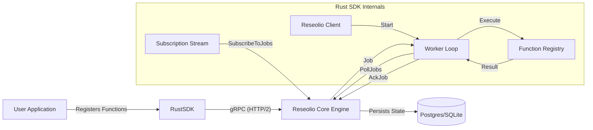

# Rust SDK Architecture & Implementation Guide

**Date:** January 22, 2026
**Version:** 0.1.0
**Author:** Antigravity (Google DeepMind)

---

## 1. Overview
The **Reseolio Rust SDK** is a high-performance, type-safe library for building durable applications. It enables Rust developers to define functions that are resilient to failures, retriable, and schedulable, by connecting to the `reseolio-core` engine.

This document replicates the behavior of the Node.js SDK but leverages Rust's ownership model and async runtime (`tokio`) for superior concurrency and safety.

---

## 2. Architecture & Connectivity

### System Diagram


### Key Components

1.  **gRPC Communication (`src/client.rs`)**:
    *   The SDK communicates with the core engine primarily via gRPC using `tonic`.
    *   **Port:** Default port used is `50051`.
    *   **Protocol:** HTTP/2 (required by gRPC).
    *   **Connectivity**: The `Reseolio` struct manages a persistent `ReseolioClient`.

2.  **Worker Loop ("The Heart")**:
    *   **Role**: Continuously asks the core for work (`PollJobs`).
    *   **Concurrency**: Implemented as a "fire-and-forget" model. When a job is received, it spawns a `tokio::task` immediately, allowing the worker to process multiple jobs in parallel up to the `concurrency` limit handled by the Core.
    *   **Refactor Note**: We changed `run_worker_loop` to take `Arc<Self>` to allow safe sharing of the client across these spawned tasks.

3.  **Subscription Stream**:
    *   **Role**: A dedicated bidirectional stream (`SubscribeToJobs`) that listens for job completion events.
    *   **Usage**: When you call `.call().await`, the SDK sends the job and then *waits* on a `oneshot` channel triggered by this stream.

---

## 3. Feature Walkthrough (How to Read the Code)

### A. Client Initialization & Config (`src/client.rs`)
The entry point is `Reseolio::new(config)`.
*   **What to read**: Start at `impl Reseolio`. Look at `new` and `start`.
*   **Key Concept**: `ReseolioInner` struct holds the shared state (`Arc<RwLock<...>>`) to allow safe concurrent access from the worker loop and user threads.

### B. Durable Functions (`src/durable.rs`)
This module handles the "Registration" pattern.
*   **Concept**: We wrap the user's closure in a `RegisteredFunction` struct.
*   **Type Safety**: We enforce that arguments (`Args`) and return values (`Ret`) implements `Serialize` + `DeserializeOwned`.
*   **Code Path**: `durable.call()` -> serializes args -> calls `client.enqueue()` -> returns `JobHandle`.

### C. Job Execution Flow (`src/job.rs`)
*   **JobHandle**: An abstraction over a `job_id`. allows methods like `.result()`, `.cancel()`.
*   **Execution**: Inside `execute_job` (in `client.rs`), we deserialize arguments, invoke the stored handler, and then send an `AckJob` RPC back to the core with the result.

### D. Scheduling (`src/schedule.rs`)
*   **Concept**: Managing Cron jobs.
*   **Implementation**: `ScheduleHandle` provides methods to `pause`, `resume`, `delete`.
*   **Code**: Check `create_schedule` in `client.rs` which constructs the proto request.

### E. Tracing (`src/tracing_support.rs`)
*   **Integration**: Uses `opentelemetry` and `tracing-subscriber`.
*   **How it works**: We annotated critical async methods with `#[instrument]`. This automatically creates spans with fields like `job_id`, `worker_id`.

---

## 4. Testing Strategy

We implemented two layers of testing to ensure correctness:

### 1. Unit Tests (`tests/types_test.rs`)
*   **Goal**: Verify pure logic without network.
*   **What we test**:
    *   Configuration defaults.
    *   Proto message construction.
    *   Type serialization (JSON to Bytes).
    *   Validating that `JobOptions` builder pattern works.

### 2. Integration Tests (`tests/client_test.rs`)
*   **Goal**: Prove the Client <-> Server handshake works via `tonic`.
*   **The Mock**: We implemented a `MockReseolioServer` that implements the `Reseolio` gRPC trait. It mimics the core engine.
*   **The Mocking Technique**:
    1.  **Dynamic Port**: We bind to port `0` to get a free OS port.
    2.  **Server Lifecycle**: We spawn the `tonic` server in a background tokio task.
    3.  **Readiness Check**: We loop `TcpStream::connect(addr)` to ensure the server is listening before the client tries to handshake.
    4.  **Channel Injection**: We manually build a `tonic::transport::Channel` and inject it into the client using `start_with_channel` to avoid configuration parsing errors (like the double `http://` issue we solved).
*   **Scenario**:
    *   Client starts.
    *   Client registers a function.
    *   Client calls `durable_func.call()`.
    *   Mock Server receives `EnqueueJob` request.
    *   Mock Server returns a `job_id`.
    *   Test asserts the ID matches.

---

## 5. How to Integrate
To use this SDK in your workspace:

1.  **Add to Cargo.toml**:
    ```toml
    [dependencies]
    reseolio = { path = "sdks/rust" }
    tokio = { version = "1", features = ["full"] }
    ```
2.  **Run with Core**:
    Ensure the `reseolio` binary is in your path or managed by the SDK's `auto_start` feature.

This SDK is the bridge between your high-performance Rust business logic and the durable execution capabilities of Reseolio.
